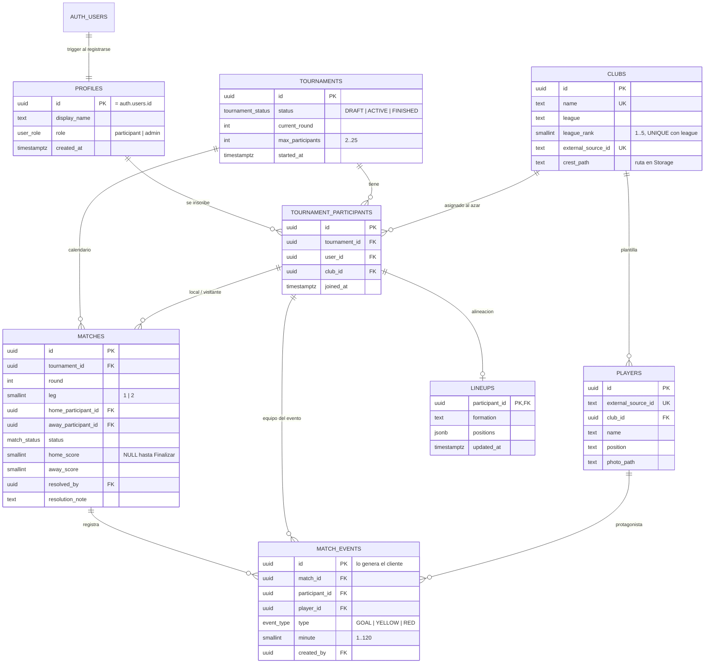

# Esquema de base de datos

Fuente de verdad: `supabase/migrations/0001..0007_*.sql`. Aplicadas con `scripts/db/apply_migrations.py`.
Estado: VERIFICADO (aplicadas en Supabase; `scripts/db/test_schema.py` 27/27, `test_assign_club.py` 3/3).

## Diagrama ER

Además: vista `standings` (derivada de `matches`) y la tabla técnica `schema_migrations` (la crea el script de migraciones).

## Por qué cada restricción

| Restricción | Qué impide | Por qué en la BD y no solo en el backend |
|---|---|---|
| `UNIQUE(tournament_id, club_id)` | Dos participantes con el mismo club en un torneo | Es la garantía última: aunque dos peticiones lleguen a la vez o el backend tenga un bug, Postgres rechaza el duplicado. Ver la explicación de `assign_random_club` en `docs/defense/database.md` |
| `UNIQUE(tournament_id, user_id)` | Inscribirse dos veces | Igual: hace idempotente la inscripción |
| `UNIQUE(id, tournament_id)` en participantes + FK compuestas en `matches` | Un partido entre participantes de torneos distintos | Un FK simple no puede comprobar que ambos lados pertenecen al mismo torneo; la FK compuesta sí |
| `CHECK(home <> away)` | Un participante jugando contra sí mismo | Invariante trivial, barata de garantizar |
| `UNIQUE(tournament_id, home, away)` | Repetir un enfrentamiento: cada par ordenado aparece una vez (ida A-B, vuelta B-A) | Protege el generador de calendario de duplicar partidos |
| `CHECK matches_score_consistency` | Marcador con partido SCHEDULED/ACTIVE, o partido finalizado sin marcador | Codifica "el marcador existe desde que el local finaliza" |
| `CHECK matches_resolved_requires_admin` | `RESOLVED` sin `resolved_by` | Toda resolución deja responsable |
| `match_events.id` sin default | Obliga al cliente a generar el UUID | Permite reenviar desde la cola offline con `ON CONFLICT (id) DO NOTHING` |
| `CHECK minute BETWEEN 1 AND 120` | Minutos absurdos | Regla cerrada del enunciado |
| `CHECK league_rank 1..5` y `UNIQUE(league, league_rank)` | Dos clubes con el mismo puesto en una liga | Top 5 por liga sin huecos duplicados. No se limita la lista de ligas en la BD para poder editar `config/tournament-clubs.json` sin migrar |
| `max_participants 2..25` | Torneos fuera de regla | 25 = clubes disponibles |
| `profiles.id` FK a `auth.users` | Perfiles huérfanos | La identidad la gestiona Supabase Auth |
| FK de participantes a `profiles`/`clubs` sin `ON DELETE CASCADE` | Borrar un usuario o club en pleno torneo y corromper la tabla | Se prefiere fallar a perder resultados |
| Enums (`match_status`, `event_type`...) | Estados inventados | La máquina de estados cerrada vive también en el tipo |

Qué NO se hace en la BD (y por qué): que un participante juegue una sola vez por jornada y la máquina de transiciones de estado se validan en el dominio (`backend/app/domain`, Fase 2+), con UPDATE condicional `WHERE status = <esperado>`. Ahí es donde se pueden probar como funciones puras.

## Decisiones de modelo

- `players.club_id` es un FK simple, no una tabla N:M: un jugador pertenece a un club en el momento del scraping. Alternativa descartada: historial de fichajes (fuera del alcance).
- `standings` es una vista con `security_invoker = true`: se calcula siempre desde `matches` (solo CONFIRMED/RESOLVED, 3/1/0) y devuelve la columna `position` con el orden PTS, DG, GF, nombre. Incluye participantes con 0 partidos. Alternativa descartada: tabla mantenida a mano (se desincroniza).
- La vista no incluye el nombre del usuario (`display_name`): con `security_invoker` el JOIN a `profiles` solo vería el perfil propio. El backend (clave secreta) puede añadir nombres si hacen falta.
- `leg`/`round` no tienen FK a una tabla de rondas: la ronda activa vive en `tournaments.current_round`.

## Pendiente (no es de esta fase)

- Bucket privado `media` de Storage (escudos y fotos): se crea en la fase del scraper.
- `clubs` y `players` están vacías hasta el seed.
